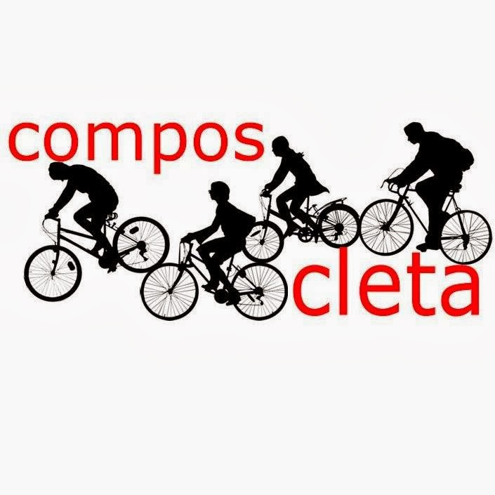

+++
title = "Nace Composcleta"
date = "2013-05-23T12:57:20+02:00"
tags = ["movilidad", "promoción"]
categories = ["historia"]
banner = "logo-composcleta.es.jpg"
authors = ["Composcleta"]
years = ["2013"]
+++

Un grupo de ciclo-usuarios de Santiago de Compostela hemos decidido constituir una asociación.

Muchos de nosotros nos conocemos gracias a foros, el grupo de Facebook y sobretodo por asistir a la [***Masa Crítica***](http://es.wikipedia.org/wiki/Masa_Cr%C3%ADtica) de Santiago, la cuál tiene lugar el último miércoles de cada mes a las 20:30 horas en la [Plaza Roxa](http://goo.gl/maps/bOi6X).

