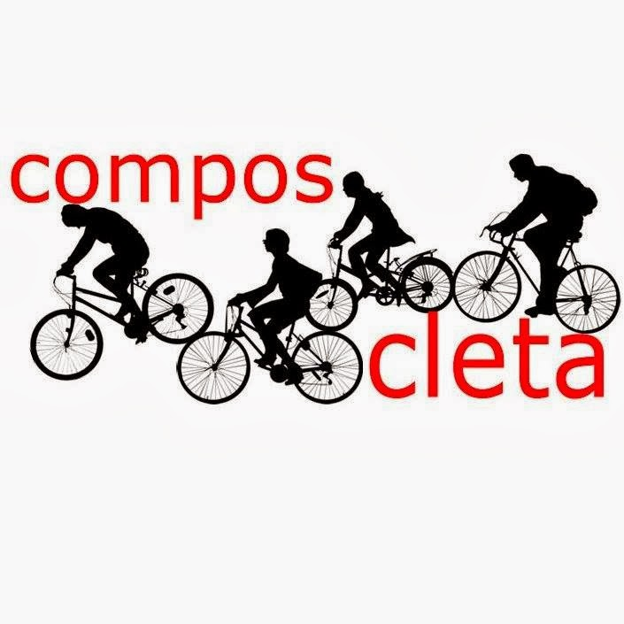

+++
title = "Nace Composcleta"
date = "2013-05-23T12:57:20+02:00"
tags = ["mobilidade", "promoción"]
categories = ["historia"]
banner = "logo-composcleta.jpg"
authors = ["Composcleta"]
years = ["2013"]
+++

Un grupo de ciclo-usuarios de Santiago de Compostela decidimos constituír unha asociación.

Moitos de nós coñecémonos grazas a foros, o grupo de Facebook e abrigo por asistir á [***Masa Crítica***](http://es.wikipedia.org/wiki/Masa_Cr%C3%ADtica) de Santiago, a cal ten lugar o último mércores de cada mes ás 20:30 horas na [Praza Roxa](http://goo.gl/maps/bOi6X).

