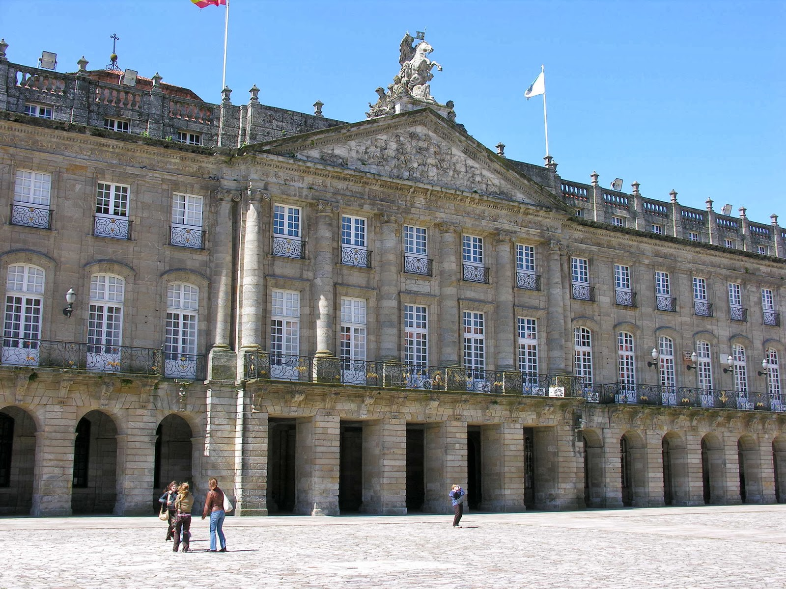

+++
title = "Reunión con el alcalde y los concelleiros de tráfico y urbanismo"
date = "2013-11-20T17:30:20+02:00"
tags = ["mobilidade", "política"]
categories = ["mobilidade"]
banner = "concello.jpg"
authors = ["Composcleta"]
years = ["2013"]
+++

Reunímonos co Ángel Currás Fernández, alcalde de Santiago de Compostela, María Pardo Valdés e Luis García Bello. A reunión durou unha hora.

María Pardo Valdés, concelleira delegada dá Área de Desenvolvemento Urbano e Sostible, con competencias en Licenzas e Disciplina Urbanística, Vivenda, Rehabilitación, Cidade Histórica, Sostibilidade (Expropiacións, Planeamento, Parques e Xardíns, Medio Ambiente, Obras e Infraestruturas, e elaboración de estudos, xestión e pregos dúas servizos básicos de Auga, Parques e Xardíns, Lixo, Alumeado e Abastecemento e Saneamento de Augas) , Sanidade, Patrimonio e Cemiterios. Voceira do Goberno municipal e da Xunta de Goberno.

Luis García Bello, concelleiro delegado dá Área de Seguridade e Mobilidade, con competencias en Mobilidade, Tráfico, Servizo de Guindastre e ORA, Policía, Bombeiros e Protección Civil.

A reunión fué nun ton maiormente cordial aínda que se puxeron de manifesto fortes diverxencias de criterio.

Pedimos dúas cousas concretas:

- Crear unha canle de comunicación co Concello
- Que nos proporcionasen ou PMUS

