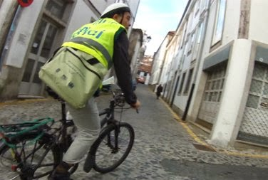

+++
title = "Rúa de San Pedro: conversaciones con varios veciños"
date = "2013-12-18T18:00:20+02:00"
tags = ["movilidad", "veciñanza"]
categories = ["movilidad"]
banner = "visita-barriosanpedro.es.jpg"
authors = ["Composcleta"]
years = ["2013"]
+++

Una vez más la "Rúa de San Pedro" está en obras y nos gustaría que se cambiaran ciertas cosas. Mucho hemos hablado entre nosotros de la complicada problemática y los diversos intereses que giran alrededor de esa emblemática calle.

Varios de nosotros fuimos a transitar por el barrio y comprobar "in situ" soluciones alternativas a la propuesta por el Concello.

También surgieron de manera espontánea conversaciones con varios vecinos. Hablamos con el propietario de la tienda "Velocípedo", el cuál tiene una opinión muy juiciosa y a nuestro entender debería ser oída por el Concello.
