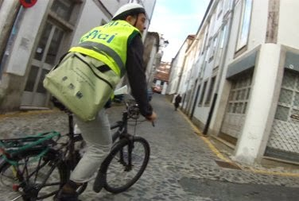

+++
title = "Rúa de San Pedro: conversaciones con varios vecinos"
date = "2013-12-18T18:00:20+02:00"
tags = ["mobilidade", "veciñanza"]
categories = ["mobilidade"]
banner = "visita-barriosanpedro.jpg"
authors = ["Composcleta"]
years = ["2013"]
+++

Unha vez máis a "Rúa de San Pedro" está en obras e gustaríanos que se cambiasen certas cousas. Moito falamos entre nós da complicada problemática e os diversos intereses que viran ao redor desa emblemática rúa.

Varios de nós fomos a transitar polo barrio e comprobar "in situ" solucións alternativas á proposta polo Concello.

Tamén xurdiron de maneira espontánea conversacións con varios veciños. Falamos co propietario da tenda "Velocípedo", o cal ten unha opinión moi xuiciosa e ao noso entender debería ser oída polo Concello.
