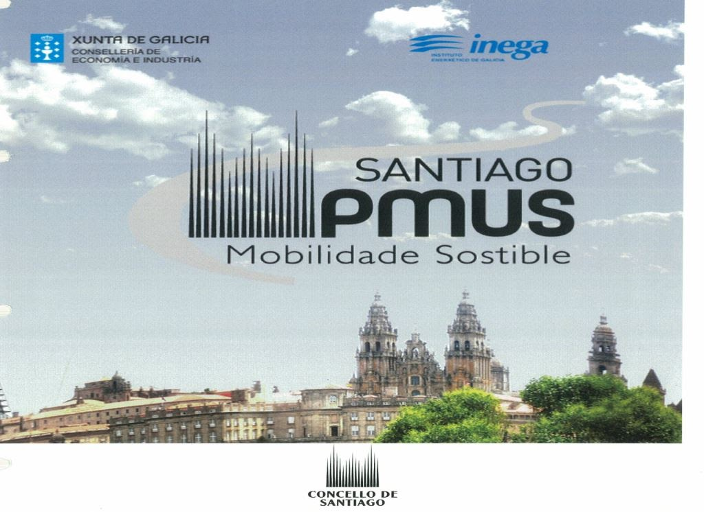

+++
title = "Plan de Movilidad Urbana Sostenible de Santiago de Compostela"
date = "2013-12-20T15:38:20+02:00"
tags = ["movilidad", "política"]
categories = ["movilidad"]
banner = "pmus.es.jpg"
authors = ["Composcleta"]
years = ["2013"]
+++

Después de dar muchas vueltas y solicitarlo a varias personas e instituciones al fin tenemos el Plan de Movilidad Urbana Sostenible de Santiago de Compostela, conocido habitualmente como PMUS. Se elaboró en 2010-2011 según deducimos de su contenido.

A nuestro entender es muy muy mejorable y las pocas medidas que proponía ni tan siquiera se planteó llevarlas a cabo.

[Hemos colgado el documento para quien lo quiera descargar](https://drive.google.com/file/d/0BzMmrnFyivD4SVNmTG1GV1dDM0E/edit?resourcekey=0-id2ohCYSqYIwUlDbmc3mCg) porque creemos que es una referencia importante:

