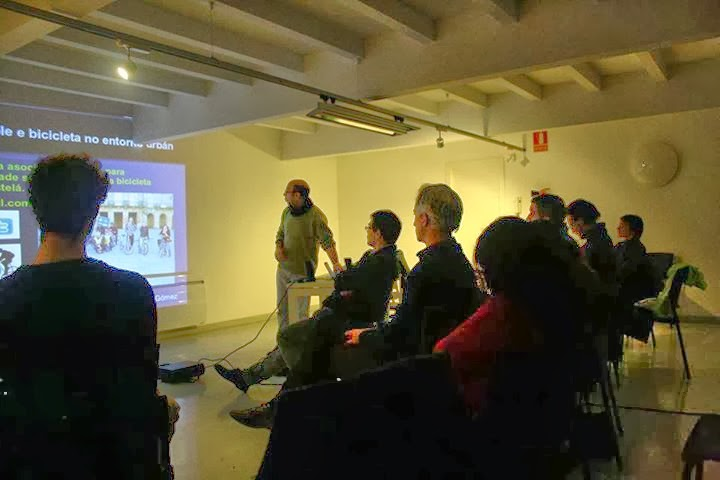

+++
title = "Taller de bici urbana en Compostela"
date = "2014-02-12T20:00:20+02:00"
tags = ["obradoiro", "mobilidade"]
categories = ["formación"]
banner = "01.es.jpg"
authors = ["Composcleta"]
years = ["2014"]
+++

[Ingeniería sin Fronteras Galicia](https://galicia.isf.es/) nos invitó a dar un obradoiro práctico sobre el uso de la bicicleta en Santiago de Compostela.

Los temas principales fueron:

- Movilidad sostible y bicicleta en el entorno urbano.
- Una revisión del entorno urbano. El ejemplo de la Rúa de San Pedro.
- Mesa redonda: *"La revisión de los modelos de movilidad: propuestas y realidades"*.

[Aquí](https://www.facebook.com/composcleta/videos/622644021142738/) podéis acceder a la presentación de Faustino.

[Aquí](https://drive.google.com/file/d/0BzMmrnFyivD4RjBPXzhYemR5SW8/edit?resourcekey=0-WE00qAniLiAdm1i2oPGFMw) tenéis la entrevista publicada al día siguiente en *La Voz de Galicia*.

