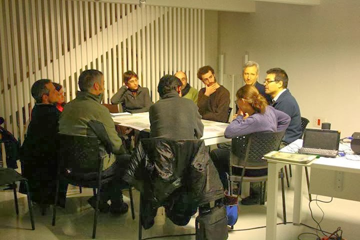
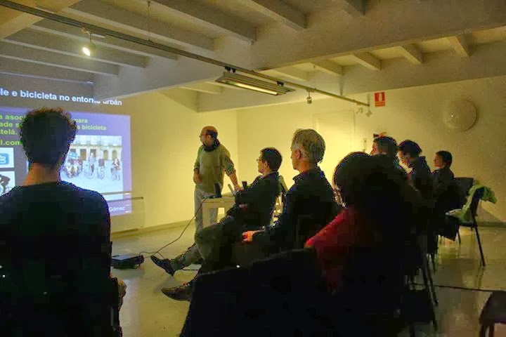

+++
title = "Obradoiro de bici urbana en Compostela"
date = "2014-02-12T20:00:20+02:00"
tags = ["obradoiro", "mobilidade"]
categories = ["formación"]
banner = "01.jpg"
authors = ["Composcleta"]
years = ["2014"]
+++

[Enxeñería Sen Fronteiras Galicia](https://galicia.isf.es/) convidounos a dar un obradoiro práctico sobre o uso da bicicleta en Santiago de Compostela.

Os temas principais foron:

- Mobilidade sostible e bicicleta no entorno urban
- Unha revisión do entorno urban. O exemplo da Rúa de S Pedro
- Mesa redonda: "A revisión dos modelos de mobilidade: propostas e realidades

[Eiqui](https://www.facebook.com/composcleta/videos/622644021142738/) podedes acceder á presentación de Faustino.

[Eeiquí](https://drive.google.com/file/d/0BzMmrnFyivD4RjBPXzhYemR5SW8/edit?resourcekey=0-WE00qAniLiAdm1i2oPGFMw) tedes a entrevista publicada ao día seguinte na Voz de Galicia

