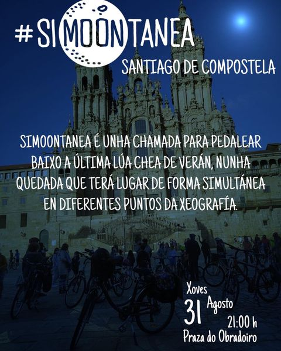

+++
title = "SiMooonTanea, una llamada para pedalear bajo la última luna llena de verano"
date = "2023-08-30T23:00:20+02:00"
tags = ["disfrute", "nocturnas", "pedaladas"]
categories = ["disfrute"]
banner = "simmontanea-composcleta.es.jpg"
authors = ["Helike"]
years = ["2023"]
+++

Simoontanea es una llamada para pedalear bajo la última luna llena de verano, en una quedada informal y entre amigos que tendrá lugar de forma simultánea en diferentes puntos de la geografía.

Convocamos a quién le apeteciera participar con estas sencillas instrucciones:

- 💡 El recorrido es sencillo, nada técnico. Como la mayoría tendremos que ir a trabajar al día siguiente (con una amplia sonrisa, por cierto), la distancia aproximada será de entre 30 y 35 kms. Llevaremos propuestas y lo decidiremos juntos a la salida y trataremos de volver a las 0:00h.
- 💡  Llevar un snack para una pausa a mitad del recorrido puede ser una buena idea.
- 💡 Imprescindible llevar luces delantera y trasera. También es aconsejable una luz frontal, por se hace falta luz de repuesto y alguna pieza reflectante.
- 💡 Busca unos cuantos amigos y/o propone en tu zona, tus redes, tu web etc.
- 💡  Y se llueve o está muy cubierto? Seremos creativos y organizaremos quizá un recorrido más urbano, un paseo, cenar todos juntos la cubierto para tramar planes futuros etc.

## Y como fue la actividad?

Sencillamente genial! Aquí tenéis [un recuerdo en nuestro Instagram](https://www.instagram.com/reel/CwpK0ggMPak/?igsh=NTYzOWQzNmJjMA==)!


