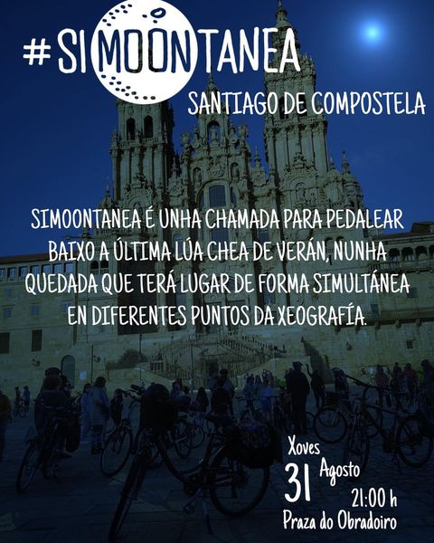

+++
title = "SiMooonTanea, unha chamada para pedalar baixo a derradeira lúa chea de verán"
date = "2023-08-30T23:00:20+02:00"
tags = ["lecer", "nocturnas", "pedaladas"]
categories = ["lecer"]
banner = "./simmontanea-composcleta.jpg"
authors = ["Helike"]
years = ["2023"]
+++

Simoontanea é unha chamada para pedalear baixo a última lúa chea de verán, nunha quedada informal e entre amigos que terá lugar de forma simultánea en diferentes puntos da xeografía.

Convocamos a quen lle apetecese participar con estas sinxelas instruccións:

- 💡 O percorrido é sinxelo, nada técnico. Como a maioría teremos que ir traballar ao día seguinte (cun amplo sorriso, por certo), a distancia aproximada será de entre 30 e 35 kms. Levaremos propostas e o decidiremos xuntos á saída e trataremos de voltar ás 0:00h.
- 💡  Levar un snack para unha pausa a metade do percorrido pode ser unha boa idea.
- 💡 Imprescindible levar luces dianteira e traseira. Tamén é aconsellable unha luz frontal, por se fai falta luz de reposto e algunha peza reflectora.
- 💡 Busca uns cuantos amigos e/o propón na túa zona, as túas redes, a túa web etc.
- 💡  E se chove ou está moi cuberto? Seremos creativos e organizaremos quizá un percorrido máis urbano, un paseo, cear todos xuntos a cuberto para tramar plans futuros etc.

## E como foi a actividade?

Sinxelamente xenial! Aquí tendes [un recordo no noso Instagram](https://www.instagram.com/reel/CwpK0ggMPak/?igsh=NTYzOWQzNmJjMA==)!


