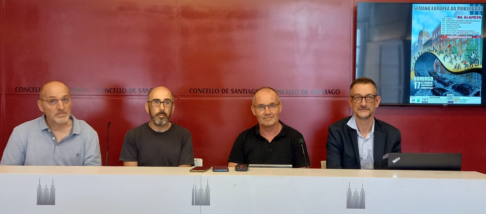
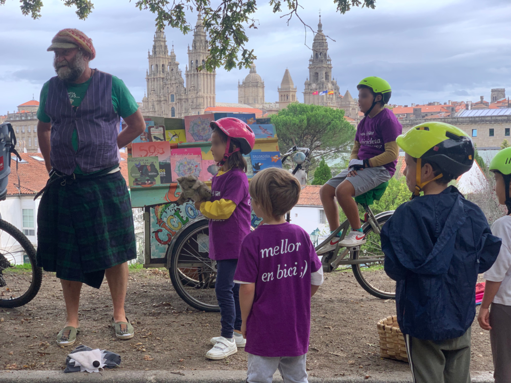
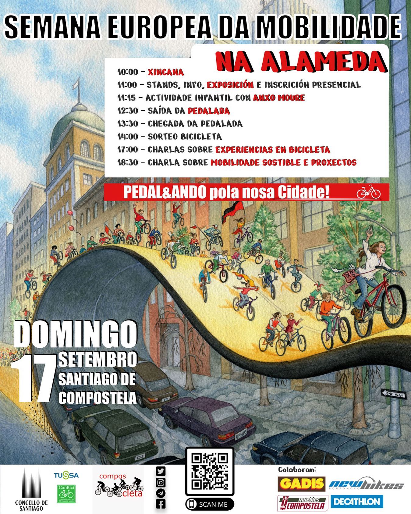
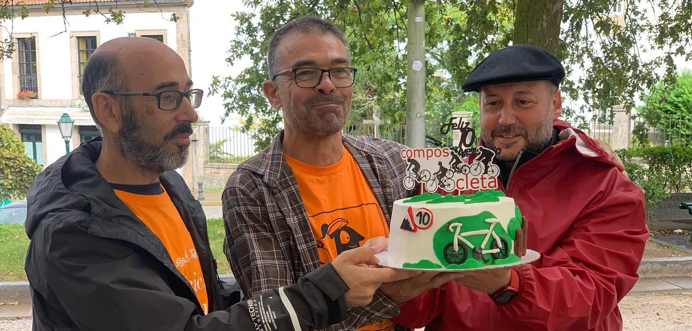

+++
title = "Semana Europea da Mobilidade 2023"
date = "2023-09-17T23:00:20+02:00"
tags = ["promoción", "eventos", "pedaladas"]
categories = ["SEM"]
banner = "./sem2023.es.jpg"
authors = ["Helike"]
years = ["2023"]
+++

Un año más, en la semana del 11 a 17 de septiembre  es la *Semana Europea de la Movilidad** 2023 (#sem2023 #mobilityWeek).

En esta ocasión Composcleta participó con el Ayuntamiento en la organización del día de la #bici del pasado domingo 17 de septiembre. Además de una pedalada por la ciudad, tuvimos diferentes actividades en la Alameda como charlas, exposiciones o actividades para los más pequeños.

Contamos con la colaboración de [Anxo Moure](https://www.instagram.com/anxo_moure/) que organizó una actividad para niñas y niños. Una gincana que montamos junto a los stands, exposición sobre la movilidad activa e infraestructuras desarrolladas para la bici en nuestra ciudad.

También, por la tarde, teníamos un par de charlas, donde compartir experiencias en bicicleta (movilidad urbana, viajes en bicicleta...) y debate sobre la movilidad urbana en el presente. Por desgracia y por motivos climáticos dejaremos para más adelante estas actividades...

Gracias a todos por participar  en esta fiesta de la bicicleta que celebramos en Santiago de Compostela! Todos las actividades fueron GRATUITAS. Además, por la inscripción tuvieron un regalo y algún afortunado grañou el sorteo de la bicicleta.

Por último, pero no por eslabón menos importante, en esta SEM 2023, también *tuvimos la ocasión de celebrar nuestro 10º aniversario de Composcleta**! Por muchos años más trabajando por la movilidad sostieble!

Os esperamos en la próxima SEM en el 2024. Fuerza y pedal!
