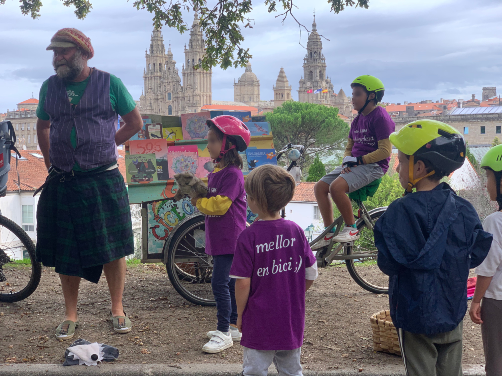

+++
title = "Semana Europea da Mobilidade 2023"
date = "2023-09-17T23:00:20+02:00"
tags = ["promoción", "eventos", "pedaladas"]
categories = ["SEM"]
banner = "./sem2023.jpg"
authors = ["Helike"]
years = ["2023"]
+++

Un ano máis, na semana do 11 ao 17 de setembro é a **Semana Europea da Mobilidade** 2023 (#sem2023 #mobilityWeek).

Nesta ocasión Composcleta participou co Concello na organización do día da #bici do pasado domingo 17 de setembro. Ademais dunha pedalada pola cidade, tivemos diferentes actividades na Alameda como charlas, exposicións ou actividades para os máis pequenos.

Contamos coa colaboración de [Anxo Moure](https://www.instagram.com/anxo_moure/) que organizou unha actividade para nenas e nenos. Unha xincana que montamos xunto ás casetas, exposición sobre a mobilidade activa e infraestruturas desenvolvidas para a bici na nosa cidade.

Tamén, pola tarde, tiñamos un par de charlas, onde compartir experiencias en bicicleta (mobilidade urbana, viaxes en bicicleta...) e debate sobre a mobilidade urbana no presente. Por desgracia e por motivos climáticos deixaremos para máis adiante estas actividades...

Grazas a todos por participar  nesta festa da bicicleta que celebramos en Santiago de Compostela! Todos as actividades foron GRATUÍTAS. Ademais, pola inscrición tiveron un agasallo e algún afortunado grañou o sorteo da bicicleta.

Por último, pero non por elo menos importante, nesta SEM 2023, tamén **tivemos a ocasión de celebrar o noso 10º aniversario de Composcleta**! Por moitos anos máis traballando pola mobilidade sostieble!

Agardámosvos na próxima SEM no 2024. Forza e pedal!
