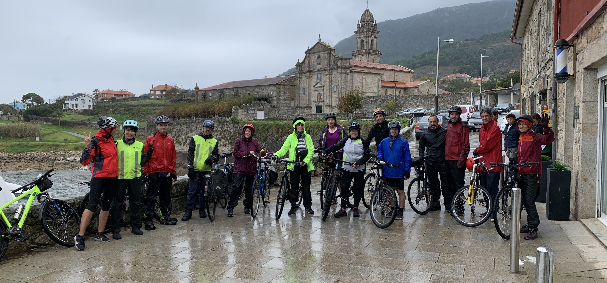

+++
title = "Outono en bici. Un roteiro de dous días de cicloturismo por Portugal"
date = "2023-10-16T23:00:20+02:00"
tags = ["lecer", "pedaladas", "cicloturismo"]
categories = ["cicloturismo"]
banner = "./hostel.jpg"
authors = ["Helike"]
years = ["2023"]
+++

🍁 Outono en bici! Composcleta organizó unha viaxe cicloturista de 2 días con pernocta por Galicia e Portugal os pasados 14 e 15 de outubro.

Percorrimos a cidade de Vigo, a Senda da auga, o Camiño De Santiago Portugués en sentido Sur, a Ecovía do Minho en Portugal, a senda xunto ao Miño polo Rosal e A Guarda, e finalmente o carril bici ata Vigo. Non usamos practicamente estradas con tráfico ou sen infraestrutura para bici, e o itinerario foi maioritariamente un roteiro moi seguro.

É un roteiro longo e por iso dividímola en dous días, para que poida ser ACCESIBLE A TODO O MUNDO que ten hábito de estar unhas horas sobre un sillín. O fixemos moi "a modo" de forma que todo o mundo disfrutou. De verdade. Foi un éxito.



É un roteiro que kilométricamente pode parecer inaccesible para moitos (140km) pero que é extraordinariamente chaira, sen practicamente grandes costas ou desniveis en ascenso. Ademais será maioritariamente con pavimento firme que axuda moito nas longas distancias.
Dispoñíamos con todo dunha "furgoneta escoba" por se houbese calquera contratempo (que non foi o caso). Organizámonos da seguinte maneira:

- ☝️ Transporte en autobús de Santiago a Vigo con transporte da bici en furgoneta.
- ☝️ Pernoita en Hostel en Portugal
- ☝️ Cea do Sábado
- ☝️ Almorzo do Domingo
- ☝️ Transporte en autobús de Vigo a Santiago con transporte da bici en furgoneta.

Ninguén precisou dunha bici especial para esta actividade, pero si que estivese en boas condicións mecánicas.

Aquí tendes un bo recordo e o percorrido en gpx no seguinte enlace: [gpx](gpx/Ciclotouring-Vuelta-al-Valle-VIgo-Portugal.gpx)

