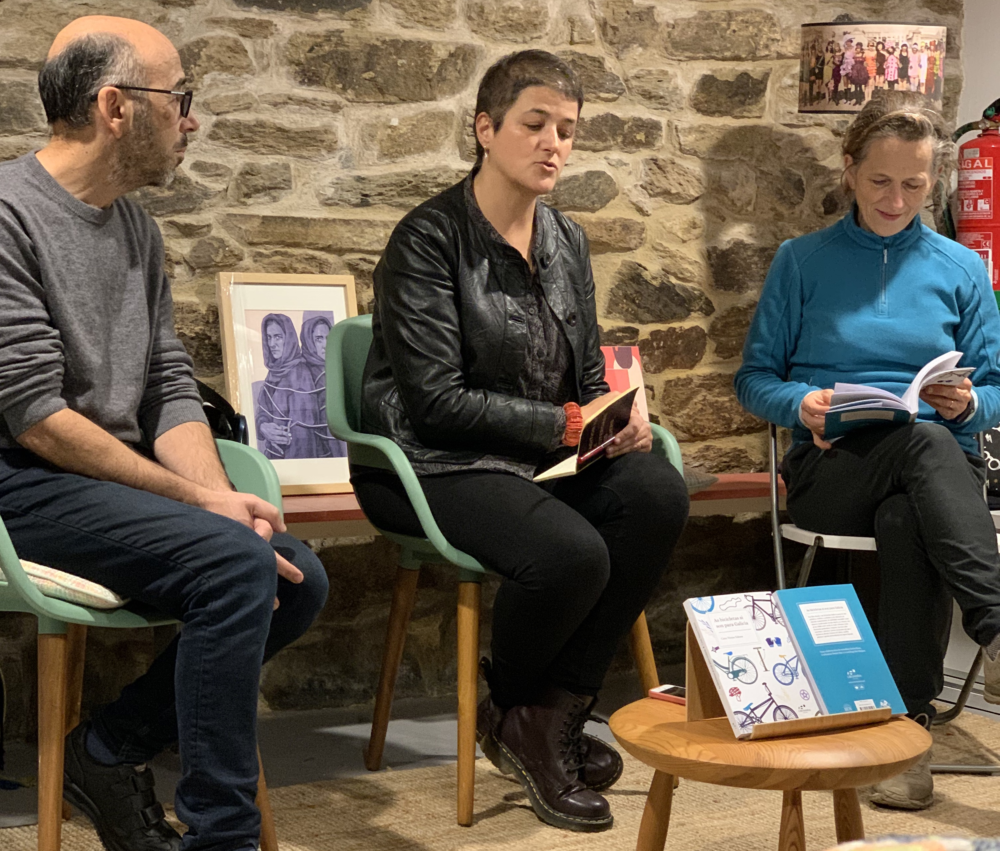

+++
title = "Presentación do Libro as Bicicletas si son para Galicia"
date = "2023-12-12T19:00:20+02:00"
tags = ["libros", "mobilidade", "promoción"]
categories = ["cultural"]
banner = "./presentacion-libro-as-bicicletas-si-son-para-galicia.jpg"
authors = ["Helike"]
years = ["2023"]
+++

O pasado martes 12 de decembro, desfrutamos da presentación do Libro "*As bicicletas si son para Galicia*" da [*Editorial Catro Ventros*](https://catroventos.gal)

Deixamos a presentación que nos fixeron chegar a Compostela

> O noso recente lanzamento, «As bicicletas si son para Galicia», aborda o uso da bicicleta dende un punto de vista poliédrico: ecolóxico e ecoloxista (como alternativa aos vehículos contaminantes), de mobilidade sustentable (como elemento transformador da nosa relación coa contorna, non só nas cidades senón tamén no rural) e feminista (como ferramenta empoderadora).
>
> Emporiso, hai moito máis: entrevistas a colectivos e persoas ciclousuarias que usan a bicicleta en diversos contextos de Galicia, consellos prácticos e apuntes terminolóxicos con soporte ilustrado.

Desta volta, visitamos a nosa benquerida Libraría de Mulleres [Lila de Lilith en Compostela](http://tm.santiagodecompostela.gal/es/mapa/libraria-de-mulleres-lila-de-lilith), na compaña de Faustino Gómez, presidente dun deses colectivos: Composcleta, a asociación cívica compostelá que leva anos promovendo o uso da bicicleta na cidade.

