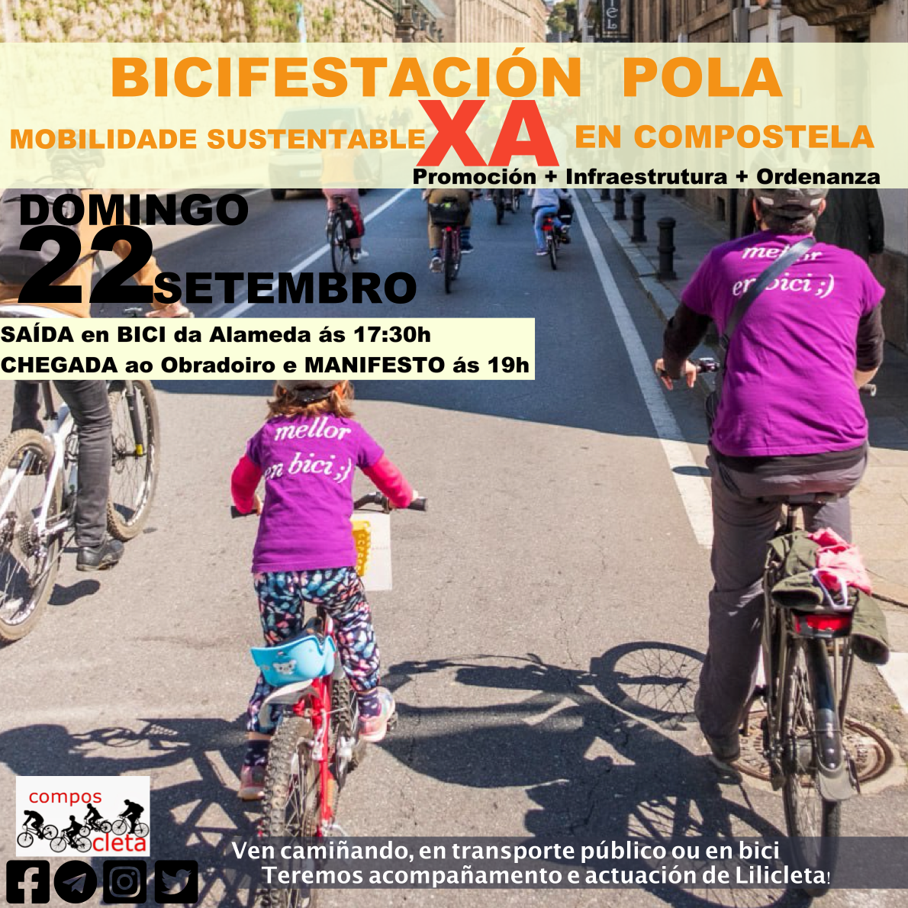

+++
title = "Bicifestación! Promoción, Intraestructura y Ordenanza"
date = "2024-09-16T19:50:20+02:00"
tags = ["política", "movilidad", "bicifestación"]
categories = ["movilidad"]
banner = "cartaz-20240922-bicifestacion.es.png"
authors = ["Faustino"]
years = ["2024"]
url = "bicifestacion2024sep"
+++

**Convocamos unha bicifestación** para reivindicar a mobilidade sustentable convocados pola Asociación Cívica Composcleta. Para pedir o compromiso e a acción do políticos do Pazo de Raxoi **en prol dunha mobilidade alternativa ao coche**.

Queremos reclamar especialmente a **defensa dos usuarios máis vulnerables no espazo público**: os que camiñan e os que pedalean. Esta cidade ten unha débeda histórica con eles porque o abafante supremacismo do tráfico motorizado que foi, durante moitos anos, a guía fundamental no deseño dos espazos de tránsito en Compostela.

**Queremos o compromiso firme e claro dunha alcaldesa** que NON foi quen de reunirse ca Asociación Cívica Composcleta durante o seu primeiro ano de mandato. Un compromiso **para desenvolver campañas de información e de fomento da mobilidade peonil, en bicicleta e transporte público**. Accións que favorezan que os nenos podan ir ao cole camiñando e en bici. Para comprender que o espazo público ten que ser habitable e amable con tódolos veciños da cidade pero especialmente cos maiores e os máis novos. Para comprender que a sustentabilidade e a garantía do futuro dos nosos fillos baseada no respecto do medio ambiente e o uso responsable dos recursos e espazos na cidade.

**Queremos** o compromiso dunha actuación integral na infraestrutura da **cidade que sexa ciclable, conectada e segura**. Que se realice a implantación integral do Plan Director da Bicicleta incluido no actual Plan de Mobilidade Urbana Sostible ([PMUS](http://santiagodecompostela.gal/medi/departamento/atencion_cidadan/Trafico/PMUS_Santiago2.pdf)). Porque a realización de tramos desconectados ca **falta dun criterio homoxéneo de deseño e seguridade é ineficaz e retrasa permanentemente que a mobilidade en bicicleta** poda medrar nesta cidade. Pedimos a mellora da sinalización e a reordenación do tráfico favorecendo a circulación dos peóns e as bicicletas especialmente nos semáforos e interseccións.

**Pedimos** o compromiso, al menos, **da aprobación dunha nova Ordenanza de Circulación e Uso da Vía Pública** (non xa a necesaria **Ordenanza de Mobilidade** que outras cidades teñen dende hai anos) acorde aos tempos nos que xa estamos vivindo. Unha nova Ordenanza pola que nós loitamos e que foi votada nun pleno do concello no ano 2021 e que, pendente da súa aprobación definitiva, **quedou nun caixón para o recordo** dende aquela. **A actual ordenanza ten máis de 25 anos e está completamente desfasada**; E foi a actual alcaldesa, cando estaba na oposición hai catro anos, a que nos dixo que o seu grupo político defendía este cambio tan necesario. Temos que regular os novos espazos de convivencia entre peóns, bicicletas e vehículos de mobilidade persoal, temos que incorporar a nova lexislación xa aprobada a nivel estatal e temos fundamentalmente que defender e garantir a seguridade de peóns e ciclistas e seu acceso prioritario os espazos residenciais da cidade.

Queremos actuacións XA! Mobilidade Sostible XA en Compostela! **Promoción real, Infraestrutura conectada e segura e unha Ordenanza que protexa aos usuarios vulnerables**. Por unha Compostela máis sustentable e mellor para todos.
