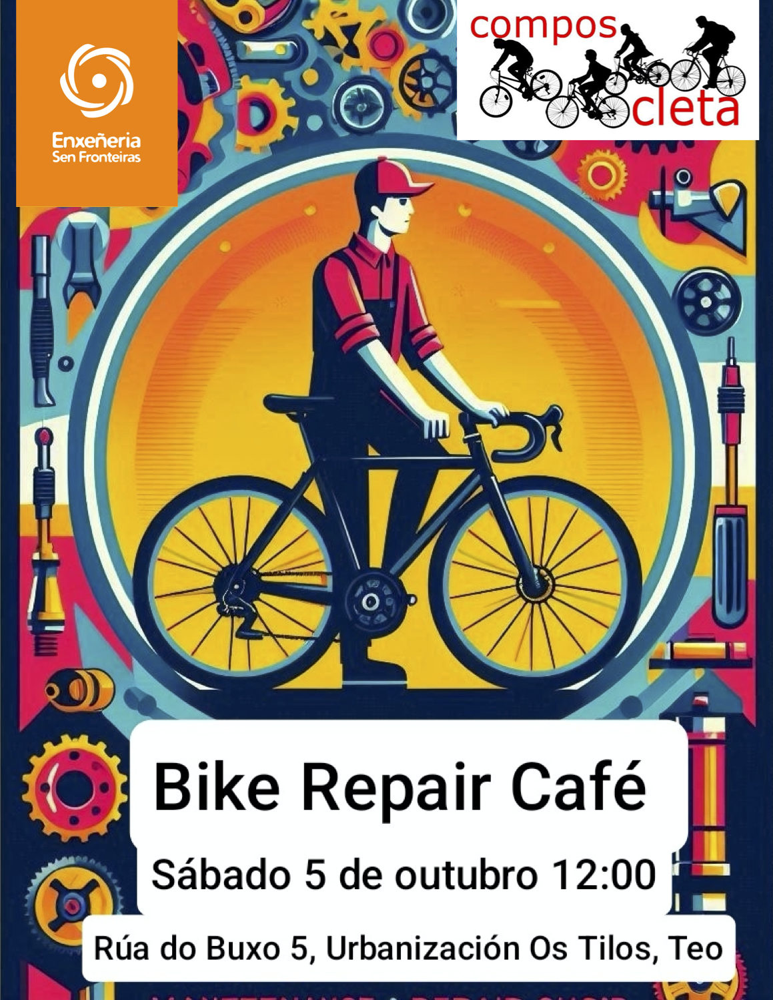

+++
title = "Bike Repair Café"
date = "2024-10-03T12:15:20+02:00"
tags = ["obradoiro", "eventos"]
categories = ["formación"]
banner = "cartel-bike-repair-cafe.es.png"
authors = ["Helike"]
years = ["2024"]
+++

El próximo sábado estaremos en el [Banco de Reciclaje de Teo](https://galicia.isf.es/bancos-de-reciclaxe-electronica-con-software-libre/) en una jornada organizada en colaboración con [Ingenieros sin Fronteras](https://galicia.isf.es/). A partir de las 10:30am, se hablará del reciclado de ordenadores, software libre, gaming, etc. Nosotros, Composcleta, estaremos allí a partir de las 12:00pm para hablar de mantenimiento y reparación de bicicletas. El local se encuentra en una casita blanca de la [rúa do Buxo, 5 da urbanización dos Tilos no Concello de Teo](https://maps.app.goo.gl/L2XaavRb44QcPu3i6).

