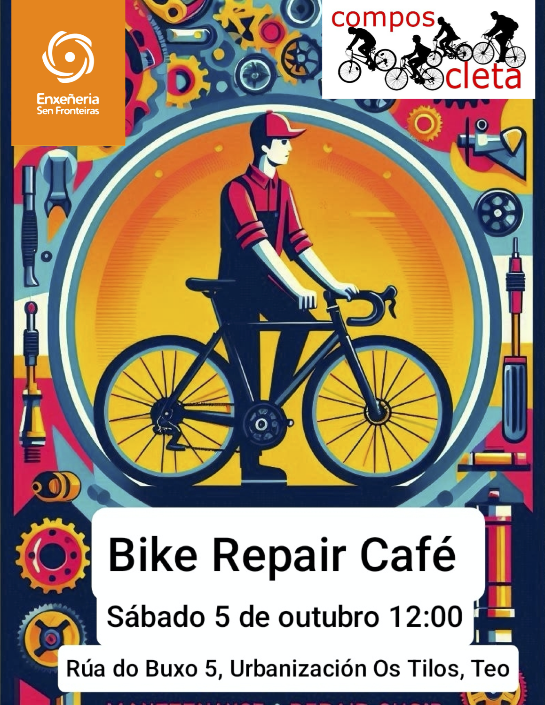

+++
title = "Bike Repair Café"
date = "2024-10-03T12:15:20+02:00"
tags = ["obradoiro", "eventos"]
categories = ["formación"]
banner = "cartel-bike-repair-cafe.png"
authors = ["Helike"]
years = ["2024"]
+++

O vindeiro sábado estaremos no [Banco de Reciclaxe de Teo](https://galicia.isf.es/bancos-de-reciclaxe-electronica-con-software-libre/) nunha xornada organizada en colaboración con [Enxeñeiros sen Fronteiras](https://galicia.isf.es/). A partires das 10:30am, falarase do reciclado de ordenadores, software libre, gaming, etc. Nós, Composcleta, estaremos alí a partires das 12:00pm para falar de mantemento e reparación de bicicletas. O local encóntrase nunha casiña branca da [rúa do Buxo, 5 da urbanización dos Tilos no Concello de Teo](https://maps.app.goo.gl/L2XaavRb44QcPu3i6).

