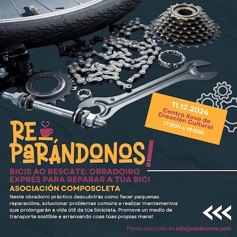
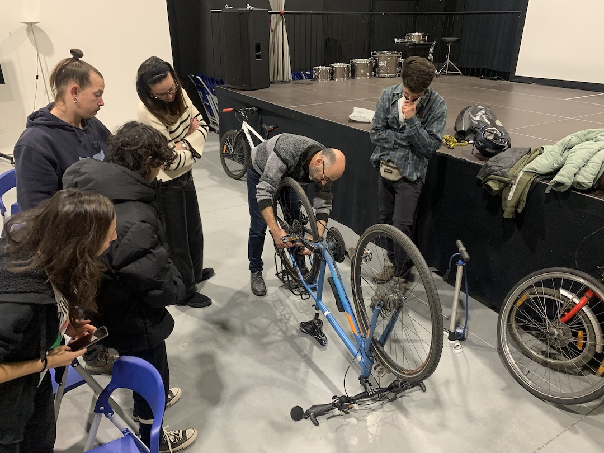
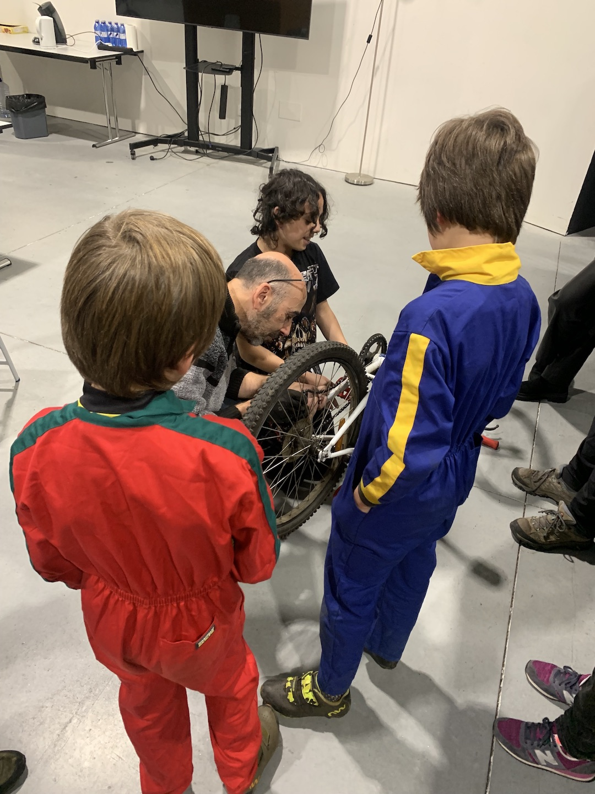

+++
title = "Taller de bicis en la Almáciga"
date = "2024-12-11T12:15:20+02:00"
tags = ["obradoiro"]
categories = ["formación"]
banner = "actividade-formativa-almaciga-02.es.jpg"
authors = ["Helike"]
years = ["2024"]
+++

El pasado miércoles estuvimos en un taller organizado en colaboración con el [Centro Xove de la Almáciga](https://www.facebook.com/centroxove/). Si eres ciclista urbano, aventurero de rutas o simplemente disfrutas de moverte sobre dos ruedas, seguro que en algún momento te has enfrentado a un pinchazo, una cadena floja o un freno que no responde como debería. Para que estos pequeños inconvenientes no detengan tus pedaleos, la Asociación Composcleta organizará talleres prácticos como éste de reparación de bicicletas.

A actividade consistiu en descubrir como facer pequenas reparacións, solucionar problemas comúns e realizar mantementos que prolongarán a vida útil das bicicletas.

O obxectivo é manter a túa bicicleta en bo estado e seguir rodando sen depender sempre dun taller mecánico. Ademais, ao aprender a facer estas reparacións por ti mesmo, contribúes a fomentar un transporte sostible e autosuficiente.

Deixamos unhas imaxes da actividade!

## Que aprendemos?

Neste obradoiro exprés, descubrimos como:

- Reparar unha picada sen complicacións.

- Axustar e tensar a cadea.

- Regular os freos e cambios.

- Identificar desgastes e previr avarías.

Dejamos unas imágenes de la actividad!

