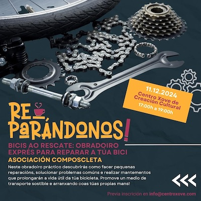

+++
title = "Obradoiro de bicis na Almáciga"
date = "2024-12-11T12:15:20+02:00"
tags = ["obradoiro"]
categories = ["formación"]
banner = "actividade-formativa-almaciga-02.jpg"
authors = ["Helike"]
years = ["2024"]
+++

O pasado mércores estivemos nun obradoiro organizado en colaboración co [Centro Xove da Almáciga](https://www.facebook.com/centroxove/). Se es ciclista urbano, aventureiro de roteiros ou simplemente gozas de moverche sobre dúas rodas, seguro que nalgún momento enfrontáchesche a unha picada, unha cadea frouxa ou un freo que non responde como debería. Para que estes pequenos inconvenientes non deteñan os teus pedaleos, a Asociación Composcleta organizará talleres prácticos como este de reparación de bicicletas.

A actividade consistiu en descubrir como facer pequenas reparacións, solucionar problemas comúns e realizar mantementos que prolongarán a vida útil das bicicletas.

O obxectivo é manter a túa bicicleta en bo estado e seguir rodando sen depender sempre dun taller mecánico. Ademais, ao aprender a facer estas reparacións por ti mesmo, contribúes a fomentar un transporte sostible e autosuficiente.

Deixamos unhas imaxes da actividade!

## Que aprendemos?

Neste obradoiro exprés, descubrimos como:

- Reparar unha picada sen complicacións.

- Axustar e tensar a cadea.

- Regular os freos e cambios.

- Identificar desgastes e previr avarías.

Deixamos unhas imaxes da actividade!

