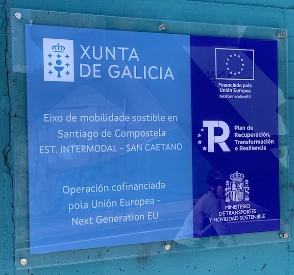

+++
title = "Comunicado da Asociación Cívica Composcleta sobre a vía peonil-ciclista Milladoiro - Santiago de Compostela"
date = "2025-02-18T12:15:20+02:00"
tags = ["ciclovía-milladoiro"]
categories = ["movilidad"]
banner = "eixo-mobilidade-sostible.es.jpg"
authors = ["Faustino"]
years = ["2025"]
+++

Mediante el siguiente comunicado, la **Asociación Cívica Composcleta manifiesta su apoyo** a la ejecución de un carril bici o ciclovía entre los núcleos urbanos del Milladoiro y Santiago de Compostela, y que está llevando a cabo a Agencia Gallega de Infraestructuras al amparo de las políticas europeas para promover la movilidad sostenible.

Parece que se está desvirtuando este proyecto desde la lucha política. Sin embargo, la propuesta partió de una de una asociación cívica, con un enfoque medioambiental y social, y que después fue desarrollada por personas funcionarias técnicas de la Agencia Gallega de Infraestructuras. Independientemente de los partidos que coxunturalmente rixen los gobiernos locales y autonómico, es una iniciativa que claramente pretende hacer avanzar nuestra ciudad cara un modelo de transporte sostenible beneficioso para la salud de todas/os. Santiago de Compostela lleva mucho retraso respecto a otras zonas de Europa, de la península Ibérica e incluso de Galicia.

Esta propuesta tuvo, y tiene, como objetivo potenciar la bicicleta como medio de movilidad alternativa para, combinado con el transporte público y los desplazamientos a pie, favorecer:

- La reducción de las emisiones de gases de efecto invernadero y gases perjudiciales para la salud de los ser vivos.
- La reducción del ruido en las ciudades.
- La merma de los riesgos de siniestros de tráfico.
- La salud general de la población mediante la movilidad activa.
- La recuperación del espacio público actualmente dedicado al uso intensivo de tránsito y estacionamiento de coches.

La asociación Composcleta elaboró en 2019 la propuesta original en la cual se basó la Agencia Gallega de Infraestructuras para desarrollar el actual proyecto de vía de conexión peatonal- ciclista Santiago-Milladoiro. **Como asociación de personas ciclousuarias de la ciudad queremos manifestar que el carril bici que la administración autonómica está ejecutando en la actualidad es una actuación positiva y necesaria en el desarrollo de la infraestructura ciclista.**

Esta financiación procedente de Europa, que solo se puede usar en proyectos de intermodalidade, estacionamiento y carril bici para la movilidad sostenible, redundará en un efecto beneficioso para la ciudad, articulando el resto de rutas seguras para bicicletas en la movilidad urbana sostenible que precisa Santiago.

Un carril bici dedicado a las bicicletas y secretado de las personas que caminan es esencial para que una persona ciclousuaria pueda moverse rápidamente, convirtiendo la bicicleta en un medio de movilidad competitivo frente al coche en términos de tiempo y esfuerzo. La seguridad es un aspecto crucial de estas vías, ya que es una de las causas fundamentales por las que la bicicleta no representa un medio de movilidad mayoritario en nuestra sociedad. Debemos resaltar especialmente la idea del diseño de “vías seguras para todas las personas y edades, especialmente nos extremos comprendidos entre 8 y 80 años” [(www.880cities.org)](www.880cities.org).

Nuestra asociación no es ajena a la polémica generada por algunos colectivos de la ciudad para oponerse la este carril bici hasta Milladoiro. Como asociación participamos en asambleas vecinales en los barrios de Sar y Fontiñas presentando nuestra propuesta inicial y defendiendo la utilidad de esta infraestructura. Expresamos la duda sobre la idoneidad de alguno detalle técnico relativo a la ejecución de la obra, pero coincidimos en el fondo de la misma y valoramos positivamente cualquier avance para la realización de la vía peatonal ciclista. Lamentamos que no fuera posible un acuerdo entre el Ayuntamiento de Santiago y la Xunta de Galicia al respeto.

El trazado propuesto por la zona del Banquete de Conxo consigue un desnivel mínimo en las pendientes existentes entre Santiago y Milladoiro. Esto es fundamental para conectar las usuarias con los servicios y puntos de destino de la ciudad sin realizar elevado esfuerzo físico, haciéndolo competitivo frente a uso del coche privado. Además permite el empleo de infraestructuras ferroviarias en desuso que cumplen con estos requisitos de limitación del desnivel.

El Banquete de Conxo además de ser un lugar de paso es también un destino en sí mismo. Esta vía permitirá la accesibilidad, tanto en bicicleta, en silla de ruedas, VMP, o con carritos de crianzas, con una superficie de rodaje adecuado que pueda ser adaptada a su entorno.

En ningún momento el proyecto contempló asfaltar el Banquete de Conxo ni lo derribo de árboles singulares, tal y como recogieron los mensajes alarmistas de diferentes colectivos. Como asociación especialmente implicada en la defensa del medio ambiente, pedimos siempre que las obras se realicen con la máxima sensibilidad para preservar el medio natural. También valoramos positivamente la modificación del trazado empleando el entorno del Hospital Provincial, minimizando la coincidencia con el proyecto del Ecobosque de Conxo. Al mismo tiempo no debemos ignorar el impacto medioambiental que ya tienen los más de 200 mil coches que transitan diariamente por las cercanías de nuestra ciudad, y muy particularmente en el entorno de este enclave (autopista y vías de alta capacidad).

La propuesta alternativa por las calles de Torrente y Benéfica de Conxo (por Televés), no es aceptable por comprometer las condiciones de uso de la misma. Por una parte, esta modificación compromete las condiciones de seguridad mediante un diseño no homogéneo a lo largo de su recorrido. Por otra, obligaría a las personas ciclousuarias la circular en una carretera compartida con vehículos a motor (no secretada) y con una fuerte pendiente. Esto penalizaría las condiciones ventajosas del trazado original secretado para conectar ambos núcleos urbanos.

El trazado de este carril bici ofrece a las usuarias conexiones con la estación intermodal, el Ensanche, Fontiñas, zonas comerciales y con centros escolares, sanitarios y deportivos. Estas aportaciones permitirán atraer un número elevado de personas usuarias.

Los preocupan, en particular, la conexión de la Calle Clara Campoamor (actual carril bici) con la Calle de Sar, ya que, dada su anchura, no permite el tráfico bidireccional de bicicletas junto con coches sin comprometer las condiciones de seguridad. Consideramos que esta pista de conexión debe estar definitivamente cerrada a los vehículos a motor y dedicar la otros usos el espacio actualmente utilizado como aparcamiento.

Por último, queremos suliñar las características que debe cumplir tanto este nuevo carril bici como el resto de las infraestructuras que se construyan o se adapten para esta nueva movilidad sostenible:

1. Seguridad: Recorrido seguro para cualquier usuario-ciclista, que evita en la medida del posible a competencia con el tráfico motorizado.

2. Coherencia: Rutas sin interrupciones, con continuidad a lo largo de su recorrido y que conducen directamente de un punto a otro, sin tomar largos rodeos innecesarios; y conectado con las infraestructuras de la ciudad.

3. Comodidad: Rutas que permiten un tránsito fluido de bicicletas y de empleo fácil para todo tipo de usuarias de bicicletas, con baja pendiente, superficie compacta, con la finalidad de una movilidad rápida y cómoda.

4. Atractivo: Rutas que pongan en valor el medio ambiental, histórico, cultural y social a lo largo de su recorrido, conectando zonas atractivas de la ciudad e integrándose con otros destinos para formar una red ciclista más amplia.

La Asociación Cívica Composcleta sociación está siempre la disposición de cualquier administración, institución o colectivo, para colaborar en este cambio modal de la movilidad, que debemos conseguir entre todas, mediante el consenso y voluntad de cambio, liderazgo por las administraciones pero también contando cas aportaciones de la sociedad civil.

Santiago de Compostela, 18 de febrero de 2025

Fdo. Faustino Gómez

Presidente Asoc. Cívica Composcleta

