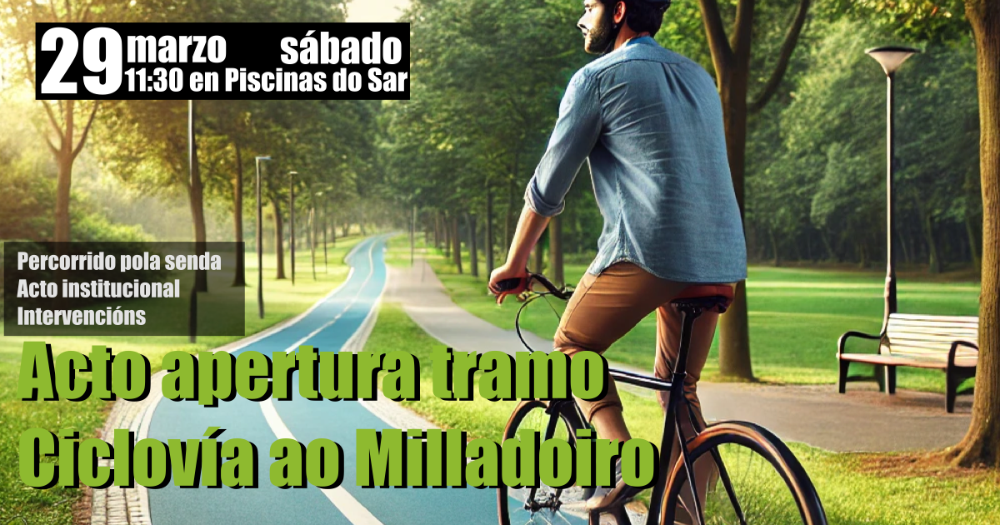

+++
title = "Acto de apertura de un tramo de la ciclovía a Milladoiro"
date = "2025-03-28T12:15:20+02:00"
tags = ["movilidad", "eventos", "pedalada", "ciclovía-milladoiro"]
categories = ["movilidad"]
banner = "apertura-ciclovia-milladoiro-fb.es.png"
authors = ["Helike"]
years = ["2025"]
+++

Este sábado se celebrará junto las Piscinas de Sar, un acto institucional en el que se abrirá parte de la Ciclovía que conectará (Santiago - San Lázaro - Chus) con el Milladoiro. El tramo en cuestión recorre por las Brañas del Sar y Estación Intermodal en un hito para la movilidad sostenible en Santiago de Compostela. Con esta importante inversión en infraestructuras, fruto de los Fondos NextGeneration de la UE y la iniciativa de por en marcha este proyecto por parte de la Xunta de Galicia, **se alcanzará un eje seguro para la movilidad en bici que en el futuro próximo se vertebrará con nuevas obras en otros puntos de la ciudad**.

La conexión de forma segura, a pie y en bicicleta, entre Santiago y Milladoiro es una demanda histórica de hace más de dos décadas. A instancia del Grupo Interparlamentar para la bicicleta del Parlamento de Galicia, Composcleta redactó una propuesta para conectar ambos núcleos, desde nuestra perspectiva de usuarios de la bicicleta e víandantes.

La propuesta que redactamos y que fue presentada a todos los grupos políticos en las elecciones municipales de 2019, la podéis consultar [en el apartado "propuestas" de nuestra web][1]. **Dicha propuesta [sivió como base][2] y se ha mejorado sustancialmente en el actual proyecto de ejecución de la Axencia Galega de Infraestructuras de la Ciclovía Santiago-Milladoiro**, en Septiembre del 2022, y gracias a los Fondos Europeos Next-Generation. Se ha modificado el trazado inicialmente propuesto pero conservando su ensencia y propósito.

**También propusimos, y todavía seguimos viendo necesaria, la conexión más directa y segura al centro de la ciudad, por el viaducto del Ponte da Rocha**, por Choupana, Rosalía de Castro, hasta la plaza de Galicia, continuando hasta San Lázaro por Ensinanza y Basquiños, principal eje vertebrador de la ciudad norte-sur. Todo esto en un contexto de emergencia climática y en un cambio de paradigma modal en el transporte urbano.

Por otro lado, **nuestra asociación no es ajena a la polémica generada por algunos colectivos de la ciudad** para oponerse la este carril bici hasta Milladoiro. Como asociación participamos en asambleas vecinales en los barrios de Sar y Fontiñas presentando nuestra propuesta inicial y defendiendo la utilidad de esta infraestructura. Expresamos la duda sobre la idoneidad de alguno detalle técnico relativo a la ejecución de la obra, pero coincidimos en el fondo de la misma y valoramos positivamente cualquier avance para la realización de la vía peatonal ciclista. Lamentamos que no fuera posible un acuerdo entre el Ayuntamiento de Santiago y la Xunta de Galicia al respeto. Si te interesan los detalles sobre nuestra postura, [**hemos elaborado un comunidado expresando nuestro apoyo a esta infraestuctura**][3].

Por último, queremos expresar que la Asociación Cívica Composcleta está siempre a la disposición de cualquier administración, institución o colectivo, para colaborar en este cambio modal de la movilidad, que debemos conseguir entre todas, mediante el consenso y voluntad de cambio, liderazgo por las administraciones pero también contando cas aportaciones de la sociedad civil.

**Deixamos o programa do acto a continuación:**

- `11:30h`: Llegada del conselleiro de Presidencia, Xustiza e Deportes, Diego Calvo, y de la conselleira de Vivenda e Planificación de Infraestruturas, María Martínez Allegue a la zona de las piscinas del Sar en este [punto de encontro](https://maps.app.goo.gl/u2Uizt1pmXm9gi3P8).

- `11:35h`: Recorrido por la senda

- `11:50h`: Intervenciones
  - 🎥 Emisión de vídeo (I)
  - 👩 Conselleira de Vivenda e Planificación de Infraestruturas, María Martínez Allegue
  - 👨 Conselleiro de Presidencia, Xustiza e Deportes, Diego Calvo
  - 🎥 Emisión de vídeo (II)

- `12:15h`: Fin del acto

**Asistentes Confirmados:**

- 👩 Directora xeral de Mobilidade, Judit Fontenla
- 👨 Director da Axencia Galega de Infraestruturas (AXI), Francisco Menéndez
- 👨 Presidente de Composcleta, Faustino Gómez
- 👨 Representante da Xunta Directiva de Cogami
- 👨 Director de obra (AXI), Carlos Lefler
- 👨 Director de Construción de Ogmios, Javier Font
- 👨 Xefe de obra de Ogmios, Javier Canosa
- 👥 Membros/as de Cogami
- 👥 Membros/as de Composcleta

<!-- Referencias externas -->
[1]: https://proxectos.composcleta.org/ciclovia-milladoiro-santiago/index.html 'Propuesta Ciclovía: O Milladoiro - Santiago'
[2]: https://drive.google.com/file/d/1zvUW8clz9PXUoEUt4VtuBJ7-Kuytpqba/view?usp=sharing 'Xunta de Galicia - Antecedentes de la propuesta'
[3]: https://drive.google.com/file/d/1layWz_Rr7YfEMFEj_kPTDQTagU9Ht_YV/view?usp=sharing '2025-FEB18 Comunicado de Composcleta en relación al proyecto de la Xunta de Galicia de ciclovía que conectará Milladoiro con Santiago'
