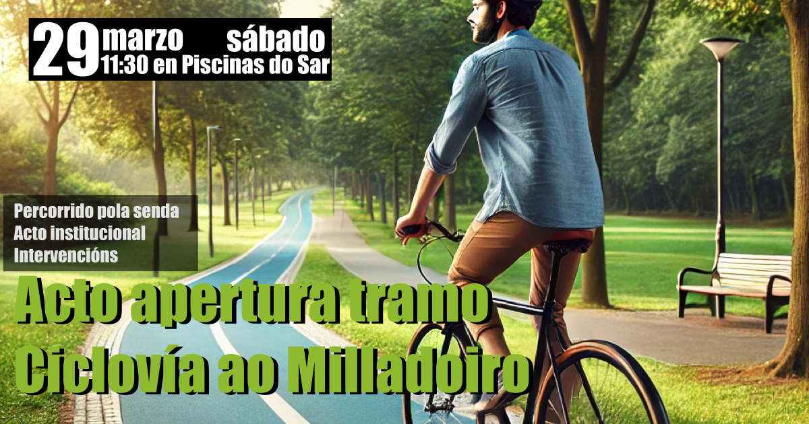
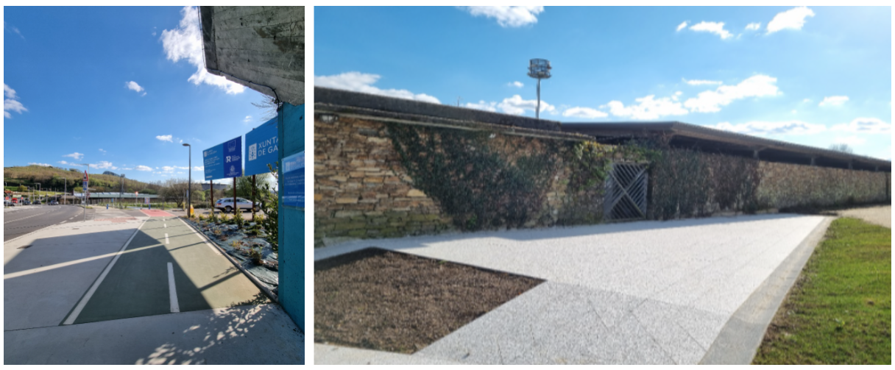

+++
title = "Acto de apertura dun tramo da ciclovía a Milladoiro"
date = "2025-03-28T12:15:20+02:00"
tags = ["mobilidade", "eventos", "pedalada", "ciclovía-milladoiro"]
categories = ["mobilidade"]
banner = "apertura-ciclovia-milladoiro-fb.png"
authors = ["Helike"]
years = ["2025"]
+++

Este sábado celebrarase xunto as Piscinas de Sar, un acto institucional no que abrirase parte da Ciclovía que conectará (Santiago - San Lázaro - Chus) co Milladoiro. O tramo en cuestión percorre polas Brañas do Sar e Estación Intermodal nun fito para a mobilidade sostible en Santiago de Compostela. Con esta importante inversión en infraestruturas, froito dos Fondos NextGeneration da UE e a iniciativa de por en marcha este proxecto por parte da Xunta de Galicia, **acadarase un eixo seguro para a mobilidade en bici que no futuro próximo vertebrarase con novas obras noutros puntos da cidade**.

A conexión de forma segura, a pé e en bicicleta, entre Santiago e Milladoiro é unha demanda histórica de hai máis de dúas décadas. A instancia do Grupo Interparlamentar para a bicicleta do Parlamento de Galicia, Composcleta redactou unha proposta para conectar ambos os núcleos, desde a nosa perspectiva de usuarios da bicicleta e viandantes.

A proposta que redactamos e que foi presentada a todos os grupos políticos nas eleccións municipais de 2019, podédela consultar [no apartado "propostas" da nosa web][1]. **Dita proposta [serviu como base][2] e mellorouse substancialmente no actual proxecto de execución da Axencia Galega de Infraestruturas da Ciclovía Santiago-Milladoiro**, en setembro do 2022, e grazas aos Fondos Europeos Next-Generation. Modificouse o trazado inicialmente proposto pero conservando a súa esencia e propósito.

**Tamén propuxemos, e aínda seguimos vendo necesaria, a conexión máis directa e segura ao centro da cidade, polo viaduto do Ponche da Rocha**, por Choupana, Rosalía de Castro, ata a praza de Galicia, continuando ata San Lázaro por Ensinanza e Basquiños, principal eixo vertebrador da cidade norte-sur. Todo isto nun contexto de emerxencia climática e nun cambio de paradigma modal no transporte urbano.

Por otro lado, **a nosa asociación non é allea á polémica xerada por algúns colectivos da cidade** para opoñerse a este carril bici ata Milladoiro. Como asociación participamos en asembleas veciñais nos barrios de Sar e Fontiñas presentando a nosa proposta inicial e defendendo a utilidade desta infraestrutura. Expresamos a dúbida sobre a idoneidade dalgún detalle técnico relativo á execución da obra, pero coincidimos no fondo da mesma e valoramos positivamente calquera avance para a realización da vía peonil ciclista. Lamentamos que non fose posible un acordo entre o Concello de Santiago e a Xunta de Galicia ao respecto. Se che interesan os detalles sobre a nosa postura, [**elaboramos un comunidado expresando o noso apoio a esta infraestutura**][3].

Por último, queremos suliñar que a Asociación Cívica Composcleta está sempre a disposición de calquera administración, institución ou colectivo, para colaborar neste cambio modal da mobilidade, que debemos conseguir entre todas, mediante o consenso e vontade de cambio, liderado polas administracións pero tamén contando cas achegas da sociedade civil.

**Deixamos o programa do acto a continuación:**

- `11:30h`: Chegada do conselleiro de Presidencia, Xustiza e Deportes, Diego Calvo, e da conselleira de Vivenda e Planificación de Infraestruturas, María Martínez Allegue á zona das piscinas do Sar neste [punto de encontro](https://maps.app.goo.gl/u2Uizt1pmXm9gi3P8).

- `11:35h`: Percorrido pola senda

- `11:50h`: Intervencións
  - 🎥 Emisión de vídeo (I)
  - 👩 Conselleira de Vivenda e Planificación de Infraestruturas, María Martínez Allegue
  - 👨 Conselleiro de Presidencia, Xustiza e Deportes, Diego Calvo
  - 🎥 Emisión de vídeo (II)

- `12:15h`: Fin do acto

**Asistentes Confirmados:**

- 👩 Directora xeral de Mobilidade, Judit Fontenla
- 👨 Director da Axencia Galega de Infraestruturas (AXI), Francisco Menéndez
- 👨 Presidente de Composcleta, Faustino Gómez
- 👨 Representante da Xunta Directiva de Cogami
- 👨 Director de obra (AXI), Carlos Lefler
- 👨 Director de Construción de Ogmios, Javier Font
- 👨 Xefe de obra de Ogmios, Javier Canosa
- 👥 Membros/as de Cogami
- 👥 Membros/as de Composcleta

<!-- Referencias externas -->
[1]: https://proxectos.composcleta.org/ciclovia-milladoiro-santiago/index.html 'Propuesta Ciclovía: O Milladoiro - Santiago'
[2]: https://drive.google.com/file/d/1zvUW8clz9PXUoEUt4VtuBJ7-Kuytpqba/view?usp=sharing 'Xunta de Galicia - Antecedentes de la propuesta'
[3]: https://drive.google.com/file/d/1layWz_Rr7YfEMFEj_kPTDQTagU9Ht_YV/view?usp=sharing '2025-FEB18 Comunicado de Composcleta en relación al proyecto de la Xunta de Galicia de ciclovía que conectará Milladoiro con Santiago'
